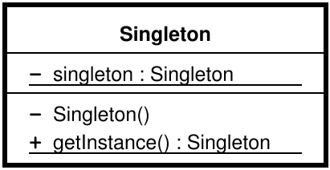
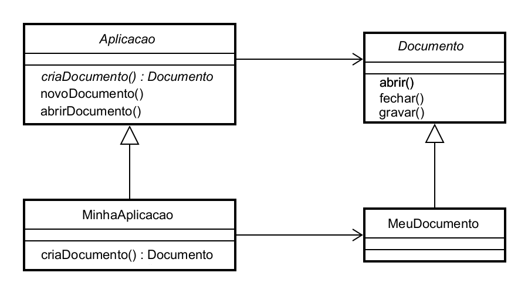
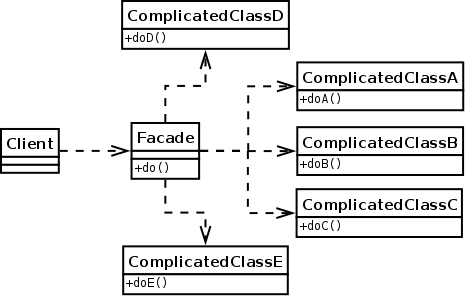
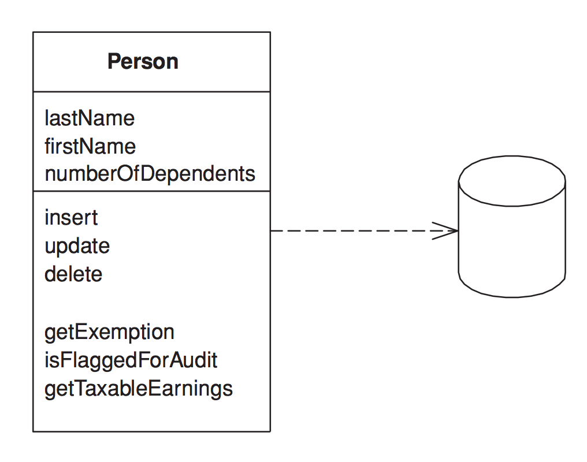
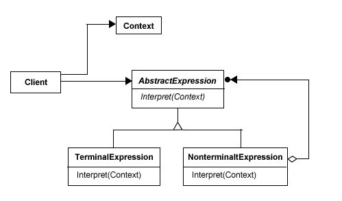
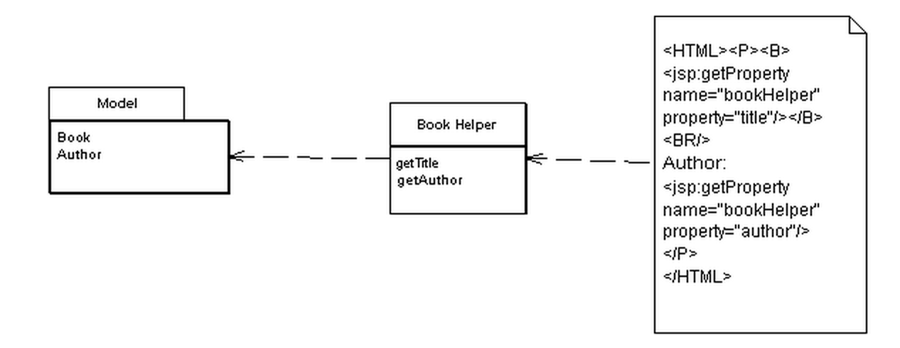
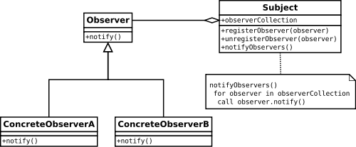
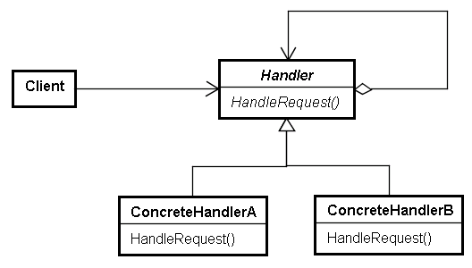
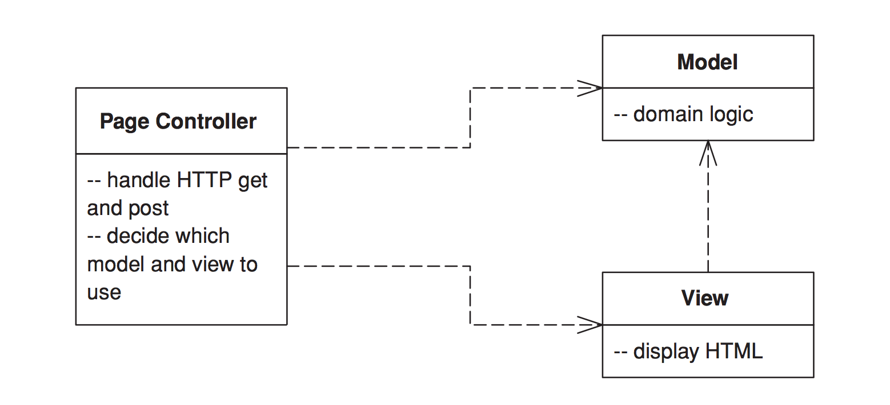
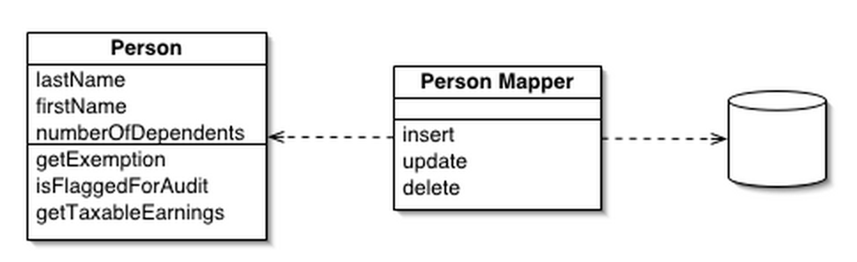

# AngularJS in Patterns

## Table of Contents

* [Abstract](#abstract)
* [Introduction](#introduction)
* [AngularJS overview](#angularjs-overview)
* [Partials](#partials)
* [Controllers](#controllers)
* [Scope](#scope)
* [Directives](#directives)
* [Filters](#filters)
* [Services](#services)
* [AngularJS Patterns](#angularjs-patterns)
* [Services](#services-1)
  * [Singleton](#singleton)
  * [Factory Method](#factory-method)
  * [Decorator](#decorator)
  * [Facade](#facade)
  * [Proxy](#proxy)
  * [Active Record](#active-record)
* [Directives](#directives-1)
  * [Composite](#composite)
  * [Interpreter](#interpreter)
  * [Template View](#template-view)
* [Scope](#scope-1)
  * [Observer](#observer)
  * [Chain of Responsibilities](#chain-of-responsibilities)
  * [Command](#command)
* [Controller](#controller-1)
  * [Page Controller](#page-controller)
* [Others](#others)
  * [Module Pattern](#module-pattern)
  * [Data Mapper](#data-mapper)
* [References](#references)

## Abstract

One of the best ways to learn something new is to see how the things you already know are used in it.
This document does not intend to make its readers familiar with the design or architectural patterns; it suggests basic understanding of the concepts of the OOP, design patterns and architectural patterns.
The goal of this paper is to describe how different software design and architectural patterns are applied in AngularJS or any AngularJS single-page application.

## Introduction

The document begins with brief overview of the AngularJS framework. The overview explains the main AngularJS components - directives, filters, controllers, services, scope. The second section lists and describes different design and architectural patterns, which are implemented inside the framework. The patterns are grouped by the AngularJS component they are used in. If some patterns are used inside multiple components it will be explicitly mentioned.

The last section contains a few architectural patterns, which are commonly used inside most of the single-page applications build with AngularJS.

## AngularJS overview

AngularJS is JavaScript framework developed by Google. It intends to provide solid base for the development of CRUD Single-Page Applications (SPA).
SPA is web application, which once loaded, does not require full page reload when the user performs any actions with it. This means that all application resources (data, templates, scripts, styles) should be loaded with the initial request or better - the information and resources should be loaded on demand.
Since most of the CRUD applications has common characteristics and requirements, AngularJS intends to provide the optimal set of them out-of-the-box. Few important features of AngularJS are:

- two-way data binding
- dependency injection
- separation of concerns
- testability
- abstraction

The separation of concerns is achieved by dividing each AngularJS application into separate components, such as:

- partials
- controllers
- directives
- services
- filters

These components can be grouped inside different modules, which helps to achieve higher level of abstraction and handle complexity. Each of the components encapsulates specific piece of the application's logic.

### Partials

The partials are HTML strings. They may contain AngularJS expressions inside the elements or their attributes. One of the distinctions between AngularJS and the others frameworks is the fact that AngularJS' templates are not in an intermediate format, which needs to be turned into HTML (which is the case with mustache.js and handlebars, for example).

Initially each SPA loads `index.html` file. In the case of AngularJS this file contains a set of standard and custom HTML attributes, elements and comments, which configure and bootstrap the application. Each sub-sequenced user action requires only load of another partial or change of the state of the application, for example through the data binding provided by the framework.

**Sample partial**

```HTML
<html ng-app>
 <!-- Body tag augmented with ngController directive  -->
 <body ng-controller="MyController">
   <input ng-model="foo" value="bar">
   <!-- Button tag with ng-click directive, and
          string expression 'buttonText'
          wrapped in "{{ }}" markup -->
   <button ng-click="changeFoo()">{{buttonText}}</button>
   <script src="angular.js"></script>
 </body>
</html>
````

With AngularJS expressions partials define what kind of actions should be performed for handling different user interactions. In the example above the value of the attribute `ng-click` states that the method `changeFoo` of the current *scope* will be invoked.

### Controllers

The AngularJS controllers are JavaScript functions, which help handling the user interactions with the web application (for example mouse events, keyboard events, etc.), by attaching methods to the *scope*. All required external, for the controllers, components are provided through the Dependency Injection mechanism of AngularJS. The controllers are also responsible for providing the *model* to the partials by attaching data to the *scope*. We can think of this data as *view model*.

```JavaScript
function MyController($scope) {

  $scope.buttonText = 'Click me to change foo!';
  $scope.foo = 42;

  $scope.changeFoo = function () {
    $scope.foo += 1;
    alert('Foo changed');
  };
}
````

For example, if we wire the sample controller above with the partial provided in the previous section the user will be able to interact with the application in few different ways.

1. Change the value of `foo` by typing in the input box. This will immediately reflect the value of `foo` because of the two-way data binding.
2. Change the value of `foo` by clicking the button, which will be labeled `Click me to change foo!`.

All the custom elements, attributes, comments or classes could be recognized as AngularJS *directives* if they are previously defined as ones.

### Scope

In AngularJS scope is JavaScript object, which is exposed to the partials. The scope could contains different properties - primitives, objects or methods. All methods attached to the scope could be invoked by evaluation of AngularJS expression inside the partials associated with the given scope or direct call of the method by any component, which keeps reference to the scope. By using appropriate *directives*, the data attached to the scope could be binded to the view in such way that each change in the partial will reflect a scope property and each change of a scope property will reflect the partial.

Another important characteristics of the scopes of any AngularJS application is that they are connected into a prototypical chain (except scopes, which are explicitly stated as *isolated*). This way any child scope will be able to invoke methods of its parents since they are properties of its direct or indirect prototype.

Scope inheritance is illustrated in the following example:

```HTML
<div ng-controller="BaseCtrl">
  <div id="child" ng-controller="ChildCtrl">
    <button id="parent-method" ng-click="foo()">Parent method</button>
    <button ng-click="bar()">Child method</button>
  </div>
</div>
```

```JavaScript
function BaseCtrl($scope) {
  $scope.foo = function () {
    alert('Base foo');
  };
}

function ChildCtrl($scope) {
  $scope.bar = function () {
    alert('Child bar');
  };
}
```

With `div#child` is associated `ChildCtrl` but since the scope injected inside `ChildCtrl` inherits prototypically from its parent scope (i.e. the one injected inside `BaseCtrl`) the method `foo` is accessible by `button#parent-method`.

### Directives

In AngularJS the directives are the place where all DOM manipulations should be placed. As a rule of thumb, when you have DOM manipulations in your controller you should create a new direcrive or consider refactoring of already existing one, which could handle the required DOM manipulations.
Each directive has a name and logic associated with it. In the simplest case the directive contains only name and definition of *postLink* function, which encapsulates all the logic required for the directive. In more complex cases the directive could contain a lot of properties such as:

- template
- compile function
- link function
- etc...

By citing the name of the directives they can be used inside the declarative partials.

Example:

```JavaScript
myModule.directive('alertButton', function () {
  return {
    template: '<button ng-transclude></button>',
    scope: {
      content: '@'
    },
    replace: true,
    restrict: 'E',
    transclude: true,
    link: function (scope, el) {
      el.click(function () {
        alert(scope.content);
      });
    }
  };
});
```

```HTML
<alert-button content="42">Click me</alert-button>
```

In the example above the tag `<alert-button></alert-button>` will be replaced button element. When the user clicks on the button the string `42` will be alerted.

Since the intent of this paper is not to explain the complete API of AngularJS, we will stop with the directives here.

### Filters

The filters in AngularJS are responsible for encapsulating logic required for formatting data. Usually filters are used inside the partials but they are also accessible in the controllers, directives, *services* and other filters through Dependency Injection.

Here is definition of a sample filter, which turns given string to uppercase:

```JavaScript
myModule.filter('uppercase', function () {
  return function (str) {
    return (str || '').toUpperCase();
  };
});
```

Inside a partial this filter could be used using the Unix's piping syntax:

```HTML
<div>{{ name | uppercase }}</div>
```

Inside a controller the filter could be used as follows:

```JavaScript
function MyCtrl(uppercaseFilter) {
  $scope.name = uppercaseFilter('foo'); //FOO
}
```

### Services

Every piece of logic, which doesn't belong to the components described above should be placed inside a service. Usually services encapsulate the domain specific logic, persistence logic, XHR, WebSockets, etc. When the controllers in the application became too "fat" the repetitive code should be placed inside a service.

```JavaScript
myModule.service('Developer', function () {
  this.name = 'Foo';
  this.motherLanguage = 'JavaScript';
  this.live = function () {
    while (true) {
      this.code();
    }
  };
});
```

The service could be injected inside any component, which supports dependency injection (controllers, other services, filters, directives).

```JavaScript
function MyCtrl(developer) {
  var developer = new Developer();
  developer.live();
}
```

## AngularJS Patterns

In the next a couple of sections, we are going to take a look how the traditional design and architectural patterns are composed in the AngularJS components.

In the last chapter we are going to take a look at some architectural patterns, which are frequently used in the development of Single-Page Applications with (but not limited to) AngularJS.

### Services

#### Singleton

>The singleton pattern is a design pattern that restricts the instantiation of a class to one object. This is useful when exactly one object is needed to coordinate actions across the system. The concept is sometimes generalized to systems that operate more efficiently when only one object exists, or that restrict the instantiation to a certain number of objects.

In the UML diagram bellow is illustrated the singleton design pattern.



When given dependency is required by any component, AngularJS resolves it using the following algorithm:

- Takes its name and makes a lookup at a hash map, which is defined into a lexical closure (so it has a private visibility).
- If the dependency exists AngularJS pass it as parameter to the component, which requires it.
- If the dependency does not exists:
  - AngularJS instantiate it by calling the factory method of its provider (i.e. `$get`). Note that instantiating the dependency may require recursive call to the same algorithm, for resolving all the dependencies required by the given dependency. This process may lead to circular dependency.
  - AngularJS caches it inside the hash map mentioned above.
  - AngularJS passes it as parameter to the component, which requires it.

We can take better look at the AngularJS' source code, which implements the method `getService`:

```JavaScript
function getService(serviceName) {
  if (cache.hasOwnProperty(serviceName)) {
    if (cache[serviceName] === INSTANTIATING) {
      throw $injectorMinErr('cdep', 'Circular dependency found: {0}', path.join(' <- '));
    }
    return cache[serviceName];
  } else {
    try {
      path.unshift(serviceName);
      cache[serviceName] = INSTANTIATING;
      return cache[serviceName] = factory(serviceName);
    } catch (err) {
      if (cache[serviceName] === INSTANTIATING) {
        delete cache[serviceName];
      }
      throw err;
    } finally {
      path.shift();
    }
  }
}
```

We can think of each service as a singleton, because each service is instantiated no more than a single time. We can consider the cache as a singleton manager. There is a slight variation from the UML diagram illustrated above because instead of keeping static, private reference to the singleton inside its constructor function, we keep the reference inside the singleton manager (stated in the snippet above as `cache`).

This way the services are actually singletons but not implemented through the Singleton pattern, which provides a few advantages over the standard implementation:

- It improves the testability of your source code
- You can control the creation of singleton objects (in our case the IoC container controls it for us, by instantiating the singletons lazy)

For further discussion on this topic Misko Hevery's [article](http://googletesting.blogspot.com/2008/05/tott-using-dependancy-injection-to.html) in the Google Testing blog could be considered.

#### Factory Method

>The factory method pattern is a creational pattern, which uses factory methods to deal with the problem of creating objects without specifying the exact class of object that will be created. This is done by creating objects via a factory method, which is either specified in an interface (abstract class) and implemented in implementing classes (concrete classes); or implemented in a base class, which can be overridden when inherited in derived classes; rather than by a constructor.



Lets consider the following snippet:

```JavaScript
myModule.config(function ($provide) {
  $provide.provider('foo', function () {
    var baz = 42;
    return {
      //Factory method
      $get: function (bar) {
        var baz = bar.baz();
        return {
          baz: baz
        };
      }
    };
  });
});

```

In the code above we use the `config` callback in order to define new "provider". Provider is an object, which has a method called `$get`. Since in JavaScript we don't have interfaces and the language is duck-typed there is a convention to name the factory method of the providers that way.

Each service, filter, directive and controller has a provider (i.e. object which factory method, called `$get`), which is responsible for creating the component's instance.

We can dig a little bit deeper in AngularJS' implementation:

```JavaScript
//...

createInternalInjector(instanceCache, function(servicename) {
  var provider = providerInjector.get(servicename + providerSuffix);
  return instanceInjector.invoke(provider.$get, provider, undefined, servicename);
}, strictDi));

//...

function invoke(fn, self, locals, serviceName){
  if (typeof locals === 'string') {
    serviceName = locals;
    locals = null;
  }

  var args = [],
      $inject = annotate(fn, strictDi, serviceName),
      length, i,
      key;

  for(i = 0, length = $inject.length; i < length; i++) {
    key = $inject[i];
    if (typeof key !== 'string') {
      throw $injectorMinErr('itkn',
              'Incorrect injection token! Expected service name as string, got {0}', key);
    }
    args.push(
      locals && locals.hasOwnProperty(key)
      ? locals[key]
      : getService(key)
    );
  }
  if (!fn.$inject) {
    // this means that we must be an array.
    fn = fn[length];
  }

  return fn.apply(self, args);
}
```

From the example above we can notice how the `$get` method is actually used:

```JavaScript
instanceInjector.invoke(provider.$get, provider, undefined, servicename)
```

The snippet above calls the `invoke` method of `instanceInjector` with the factory method (i.e. `$get`) of given service, as first argument. Inside `invoke`'s body `annotate` is called with first argument the factory method. Annotate resolves all dependencies through the dependency injection mechanism of AngularJS, which was considered above. When all dependencies are resolved the factory method is being called: `fn.apply(self, args)`.

If we think in terms of the UML diagram above we can call the provider a "ConcreteCreator" and the actual component, which is being created a "Product".

There are a few benefits of using the factory method pattern in this case, because of the indirection it creates. This way the framework can take care of the boilerplates during the instantiation of new components like:

- The most appropriate moment, when the component needs to be instantiated
- Resolving all the dependencies required by the component
- The number of instances the given component is allowed to have (for services and filters only a single one but multiple for the controllers)

#### Decorator

>The decorator pattern (also known as Wrapper, an alternative naming shared with the Adapter pattern) is a design pattern that allows behavior to be added to an individual object, either statically or dynamically, without affecting the behavior of other objects from the same class.


AngularJS provides out-of-the-box way for extending and/or enchanting the functionality of already existing services. Using the method `decorator` of `$provide` you can create "wrapper" of any service you have previously defined or used by a third-party:

```JavaScript
myModule.controller('MainCtrl', function (foo) {
  foo.bar();
});

myModule.factory('foo', function () {
  return {
    bar: function () {
      console.log('I\'m bar');
    },
    baz: function () {
      console.log('I\'m baz');
    }
  };
});

myModule.config(function ($provide) {
  $provide.decorator('foo', function ($delegate) {
    var barBackup = $delegate.bar;
    $delegate.bar = function () {
      console.log('Decorated');
      barBackup.apply($delegate, arguments);
    };
    return $delegate;
  });
});
```
The example above defines new service called `foo`. In the `config` callback is called the method `$provide.decorator` with first argument `"foo"`, which is the name of the service, we want to decorate and second argument factory function, which implements the actual decoration. `$delegate` keeps reference to the original service `foo`. Using the dependency injection mechanism of AngularJS, reference to this local dependency is passed as first argument of the constructor function.
We decorate the service by overriding its method `bar`. The actual decoration is simply extending `bar` by invoking one more `console.log statement` - `console.log('Decorated');` and after that call the original `bar` method with the appropriate context.

Using this pattern is especially useful when we need to modify the functionality of third party services. In cases when multiple similar decorations are required (like performance measurement of multiple methods, authorization, logging, etc.), we may have a lot of duplications and violate the DRY principle. In such cases it is useful to use [aspect-oriented programming](http://en.wikipedia.org/wiki/Aspect-oriented_programming). The only AOP framework for AngularJS I'm aware of could be found at [github.com/mgechev/angular-aop](https://github.com/mgechev/angular-aop).

#### Facade

>A facade is an object that provides a simplified interface to a larger body of code, such as a class library. A facade can:

>1. make a software library easier to use, understand and test, since the facade has convenient methods for common tasks;

>2. make the library more readable, for the same reason;

>3. reduce dependencies of outside code on the inner workings of a library, since most code uses the facade, thus allowing more flexibility in developing the system;

>4. wrap a poorly designed collection of APIs with a single well-designed API (as per task needs).



There are a few facades in AngularJS. Each time you want to provide higher level API to given functionality you practically create a facade.

For example, lets take a look how we can create an `XMLHttpRequest` POST request:

```JavaScript
var http = new XMLHttpRequest(),
    url = '/example/new',
    params = encodeURIComponent(data);
http.open("POST", url, true);

http.setRequestHeader("Content-type", "application/x-www-form-urlencoded");
http.setRequestHeader("Content-length", params.length);
http.setRequestHeader("Connection", "close");

http.onreadystatechange = function () {
  if(http.readyState == 4 && http.status == 200) {
    alert(http.responseText);
  }
}
http.send(params);
```
But if we want to post this data using the AngularJS' `$http` service we can:

```JavaScript
$http({
  method: 'POST',
  url: '/example/new',
  data: data
})
.then(function (response) {
  alert(response);
});
```
or we can even:

```JavaScript
$http.post('/someUrl', data)
.then(function (response) {
  alert(response);
});
```
The second option provides pre-configured version, which creates a HTTP POST request to the given URL.

Even higher level of abstraction is being created by `$resource`, which is build over the `$http` service. We will take a further look at this service in [Active Record](#active-record) and [Proxy](#proxy) sections.

#### Proxy

>A proxy, in its most general form, is a class functioning as an interface to something else. The proxy could interface to anything: a network connection, a large object in memory, a file, or some other resource that is expensive or impossible to duplicate.


We can distinguish three different types of proxy:

- Virtual Proxy
- Remote Proxy
- Protection Proxy

In this sub-chapter we are going to take a look at AngularJS' implementation of Virtual Proxy.

In the snippet bellow, there is a call to the `get` method of `$resource` instance, called `User`:

```JavaScript
var User = $resource('/users/:id'),
    user = User.get({ id: 42 });
console.log(user); //{}
```

`console.log` would outputs an empty object. Since the AJAX request, which happens behind the scene, when `User.get` is invoked, is asynchronous, we don't have the actual user when `console.log` is called. Just after `User.get` makes the GET request it returns an empty object and keeps reference to it. We can think of this object as virtual proxy (a simple placeholder), which would be populated with the actual data once the client receives response by the server.

How does this works with AngularJS? Well, lets consider the following snippet:

```JavaScript
function MainCtrl($scope, $resource) {
  var User = $resource('/users/:id'),
  $scope.user = User.get({ id: 42 });
}
```

```html
<span ng-bind="user.name"></span>
```
Initially when the snippet above executes, the property `user` of the `$scope` object will be with value an empty object (`{}`), which means that `user.name` will be undefined and nothing will be rendered. Internally AngularJS will keep reference to this empty object. Once the server returns response for the get request, AngularJS will populate the object with the data, received from the server. During the next `$digest` loop AngularJS will detect change in `$scope.user`, which will lead to update of the view.

#### Active Record

>The Active Record object is an object, which carries both data and behavior. Usually most of the data in these objects is persistent, responsibility of the Active Record object is to take care of the communication with the database in order to create, update, retrieve or delete the data. It may delegate this responsibility to lower level objects but calls to instance or static methods of the active record object cause the database communication.



AngularJS defines a service called `$resource`. In the current version of AngularJS (1.2+) it is being distributed in module outside of the AngularJS' core.

According to the AngularJS' documentation `$resource` is:

>A factory which creates a resource object that lets you interact with RESTful server-side data sources.
>The returned resource object has action methods which provide high-level behaviors without the need to interact with the low level $http service.

Here is how `$resource` could be used:

```JavaScript
var User = $resource('/users/:id'),
    user = new User({
      name: 'foo',
      age : 42
    });

user.$save();
```

The call of `$resource` will create a constructor function for our model instances. Each of the model instances will have methods, which could be used for the different CRUD operations.

This way we can use the constructor function and its static methods by:

```JavaScript
User.get({ userid: userid });
```

The code above will immediately return an empty object and keep reference to it. Once the response have been successfully returned and parsed, AngularJS will populate this object with the received data (see [proxy](#proxy)).

You can find more details for `$resource` [The magic of $resource](http://blog.mgechev.com/2014/02/05/angularjs-resource-active-record-http/) and [AngularJS' documentation](https://docs.angularjs.org/api/ngResource/service/$resource).

Since Martin Fowler states that

> responsibility of the Active Record object is to take care of the communication with the databse in order to create...

`$resource` does not implements exactly the Active Record pattern, since it communicates with RESTful service instead of the database. Anyway, we can consider it as "Active Record like RESTful communication".

### Directives

#### Composite

>The composite pattern is a partitioning design pattern. The composite pattern describes that a group of objects are to be treated in the same way as a single instance of an object. The intent of a composite is to "compose" objects into tree structures to represent part-whole hierarchies.


According to the Gang of Four, MVC is nothing more than combination of:

- Strategy
- Composite
- Observer

They state that the view is composition of components. In AngularJS the situation is similar. Our views are formed by a composition of directives and DOM elements, on which these directives could be applied.

Lets look at the following example:

```HTML
<!doctype html>
<html>
  <head>
  </head>
  <body>
    <zippy title="Zippy">
      Zippy!
    </zippy>
  </body>
</html>
```

```JavaScript
myModule.directive('zippy', function () {
  return {
    restrict: 'E',
    template: '<div><div class="header"></div><div class="content" ng-transclude></div></div>',
    link: function (scope, el) {
      el.find('.header').click(function () {
        el.find('.content').toggle();
      });
    }
  }
});
```

This example defines a simple directive, which is a UI component. The defined component (called "zippy") has header and content. Click on its header toggles the visibility of the content.

From the first example we can note that the whole DOM tree is a composition of elements. The root component is the `html` element, directly followed by the nested elements `head` and `body` and so on...

In the second, JavaScript, example we see that the `template` property of the directive, contains markup with `ng-transclude` directive inside it. So this means that inside the directive `zippy` we have another directive called `ng-transclude`, i.e. composition of directives. Theoretically we can nest the components infinitely until we reach a leaf node.

### Interpreter

>In computer programming, the interpreter pattern is a design pattern that specifies how to evaluate sentences in a language. The basic idea is to have a class for each symbol (terminal or nonterminal) in a specialized computer language. The syntax tree of a sentence in the language is an instance of the composite pattern and is used to evaluate (interpret) the sentence.



Behind its `$parse` service, AngularJS provides its own implementation of interpreter of a DSL (Domain Specific Language). The used DSL is simplified and modified version of JavaScript.
The main differences between the JavaScript expressions and AngularJS expressions that AngularJS expressions:

- may contain filters with UNIX like pipe syntax
- don't throw any errors
- don't have any control flow statements (exceptions, loops, if statements although you can use the ternary operator)
- are evaluated in given context (the context of the current `$scope`)

Inside the `$parse` service are defined two main components:

```JavaScript
//Responsible for converting given string into tokens
var Lexer;
//Responsible for parsing the tokens and evaluating the expression
var Parser;
```

Once given expression have been tokenized it is cached internally, because of performance concerns.

The terminal expressions in the AngularJS DSL are defined as follows:

```JavaScript
var OPERATORS = {
  /* jshint bitwise : false */
  'null':function(){return null;},
  'true':function(){return true;},
  'false':function(){return false;},
  undefined:noop,
  '+':function(self, locals, a,b){
        //...
      },
  '*':function(self, locals, a,b){return a(self, locals)*b(self, locals);},
  '/':function(self, locals, a,b){return a(self, locals)/b(self, locals);},
  '%':function(self, locals, a,b){return a(self, locals)%b(self, locals);},
  '^':function(self, locals, a,b){return a(self, locals)^b(self, locals);},
  '=':noop,
  '===':function(self, locals, a, b){return a(self, locals)===b(self, locals);},
  '!==':function(self, locals, a, b){return a(self, locals)!==b(self, locals);},
  '==':function(self, locals, a,b){return a(self, locals)==b(self, locals);},
  '!=':function(self, locals, a,b){return a(self, locals)!=b(self, locals);},
  '<':function(self, locals, a,b){return a(self, locals)<b(self, locals);},
  '>':function(self, locals, a,b){return a(self, locals)>b(self, locals);},
  '<=':function(self, locals, a,b){return a(self, locals)<=b(self, locals);},
  '>=':function(self, locals, a,b){return a(self, locals)>=b(self, locals);},
  '&&':function(self, locals, a,b){return a(self, locals)&&b(self, locals);},
  '||':function(self, locals, a,b){return a(self, locals)||b(self, locals);},
  '&':function(self, locals, a,b){return a(self, locals)&b(self, locals);},
  '|':function(self, locals, a,b){return b(self, locals)(self, locals, a(self, locals));},
  '!':function(self, locals, a){return !a(self, locals);}
};
```

We can think of the function associated with each terminal as implementation of the `AbstractExpression`'s interface.

Each `Client` interprets given AngularJS expression in a specific context - specific scope.

Few sample AngularJS expressions are:

```JavaScript
// toUpperCase filter is applied to the result of the expression
// (foo) ? bar : baz
(foo) ? bar : baz | toUpperCase
```

#### Template View

> Renders information into HTML by embedding markers in an HTML page.



The dynamic page rendering is not that trivial thing. It is connected with a lot of string concatenations, manipulations and frustration. Far easier way to build your dynamic page is to write your markup and embed little expressions inside it, which are lately evaluated in given context and so the whole template is being compiled to its end format. In our case this format is going to be HTML (or even DOM). This is exactly what the template engines do - they take given DSL, evaluate it in the appropriate context and then turn it into its end format.

Templates are very commonly used especially in the back-end.
For example, you can embed PHP code inside HTML and create a dynamic page, you can use Smarty or you can use eRuby with Ruby in order to embed Ruby code inside your static pages.

For JavaScript there are plenty of template engines, such as mustache.js, handlebars, etc. Most of these engines manipulate the template as a string. The template could be located in different places - as static file, which is fetched with AJAX, as `script` embedded inside your view or even inlined into your JavaScript.

For example:

```html
<script type="template/mustache">
  <h2>Names</h2>
  {{#names}}
    <strong>{{name}}</strong>
  {{/names}}
</script>
```

The template engine turns this string into DOM elements by compiling it within a given context. This way all the expressions embedded in the markup are evaluated and replaced by their value.

For example if we evaluate the template above in the context of the following object: `{ names: ['foo', 'bar', 'baz'] }`, so we will get:

```html
<h2>Names</h2>
  <strong>foo</strong>
  <strong>bar</strong>
  <strong>baz</strong>
```

AngularJS templates are actually HTML, they are not in an intermediate format like the traditional templates are.
What AngularJS compiler does is to traverse the DOM tree and look for already known directives (elements, attributes, classes or even comments). When AngularJS finds any of these directives it invokes the logic associated with them, which may involve evaluation of different expressions in the context of the current scope.

For example:

```html
<ul ng-repeat="name in names">
  <li>{{name}}</li>
</ul>
```

in the context of the scope:

```javascript
$scope.names = ['foo', 'bar', 'baz'];
```

will produce the same result as the one above. The main difference here is that the template is not wrapped inside a `script` tag but is HTML instead.


### Scope

#### Observer

>The observer pattern is a software design pattern in which an object, called the subject, maintains a list of its dependents, called observers, and notifies them automatically of any state changes, usually by calling one of their methods. It is mainly used to implement distributed event handling systems.



There are two basic ways of communication between the scopes in an AngularJS application. The first one is calling methods of parent scope by a child scope. This is possible since the child scope inherits prototypically by its parent, as mentioned above (see [Scope](#scope)). This allows communication in a single direction - child to parent. Some times it is necessary to call method of given child scope or notify it about a triggered event in the context of the parent scope. AngularJS provides built-in observer pattern, which allows this. Another possible use case, of the observer pattern, is when multiple scopes are interested in given event but the scope, in which context the event is triggered, is not aware of them. This allows decoupling between the different scopes, non of the scopes should be aware of the rest of the scopes.

Each AngularJS scope has public methods called `$on`, `$emit` and `$broadcast`. The method `$on` accepts topic as first argument and callback as second. We can think of the callback as an observer - an object, which implements the `Observer` interface (in JavaScript the functions are first-class, so we can provide only implementation of the `notify` method):

```JavaScript
function ExampleCtrl($scope) {
  $scope.$on('event-name', function handler() {
    //body
  });
}
```

In this way the current scope "subscribes" to events of type `event-name`. When `event-name` is triggered in any parent or child scope of the given one, `handler` would be called.

The methods `$emit` and `$broadcast` are used for triggering events respectively upwards and downwards through the scope chain.
For example:

```JavaScript
function ExampleCtrl($scope) {
  $scope.$emit('event-name', { foo: 'bar' });
}
```

The scope in the example above, triggers the event `event-name` to all scopes upwards. This means that each of the parent scopes of the given one, which are subscribed to the event `event-name`, would be notified and their handler callback will be invoked.

Analogical is the case when the method `$broadcast` is called. The only difference is that the event would be transmitted downwards - to all children scopes.
Each scope can subscribe to any event with multiple callbacks (i.e. it can associate multiple observers to given event).

In the JavaScript community this pattern is better known as publish/subscribe.

#### Chain of Responsibilities

>The chain-of-responsibility pattern is a design pattern consisting of a source of command objects and a series of processing objects. Each processing object contains logic that defines the types of command objects that it can handle; the rest are passed to the next processing object in the chain. A mechanism also exists for adding new processing objects to the end of this chain.



As stated above the scopes in an AngularJS application form a hierarchy known as the scope chain. Some of the scopes are "isolated", which means that they don't inherit prototypically by their parent scope, but are connected to it via their `$parent` property.

When `$emit` or `$broadcast` are called we can think of the scope chain as event bus, or even more accurately chain of responsibilities. Once the event is triggered it is emitted downwards or upwards (depending on the method, which was called). Each subsequent scope may:

- Handle the event and pass it to the next scope in the chain
- Handle the event and stop its propagation
- Pass the event to the next scope in the chain without handling it
- Stop the event propagation without handling it

In the example bellow you can see an example in which `ChildCtrl` triggers an event, which is propagated upwards through the scope chain. In the case above each of the parent scopes (the one used in `ParentCtrl` and the one used in `MainCtrl`) are going to handle the event by logging into the console: `"foo received"`. If any of the scopes should be considered as final destination it can call the method `stopPropagation` of the event object, passed to the callback.

```JavaScript
myModule.controller('MainCtrl', function ($scope) {
  $scope.$on('foo', function () {
    console.log('foo received');
  });
});

myModule.controller('ParentCtrl', function ($scope) {
  $scope.$on('foo', function (e) {
    console.log('foo received');
  });
});

myModule.controller('ChildCtrl', function ($scope) {
  $scope.$emit('foo');
});
```

The different handlers from the UML diagram above are the different scopes, injected to the controllers.

#### Command

>In object-oriented programming, the command pattern is a behavioral design pattern in which an object is used to represent and encapsulate all the information needed to call a method at a later time. This information includes the method name, the object that owns the method and values for the method parameters.


Before continuing with the application of the command pattern lets describe how AngularJS implements data binding.

When we want to bind our model to the view we use the directives `ng-bind` (for single-way data binding) and `ng-model` (for two-way data binding). For example, if we want each change in the model `foo` to reflect the view we can:

```html
<span ng-bind="foo"></span>
```

Now each time we change the value of `foo` the inner text of the span will be changed. We can achieve the same effect with more complex AngularJS expressions, like:

```html
<span ng-bind="foo + ' ' + bar | uppercase"></span>
```

In the example above the value of the span will be the concatenated uppercased value of `foo` and `bar`. What happens behind the scene?

Each `$scope` has method called `$watch`. When the AngularJS compiler find the directive `ng-bind` it creates a new watcher of the expression `foo + ' ' + bar | uppercase`, i.e. `$scope.$watch("foo + ' ' + bar | uppercase", function () { /* body */ });`. The callback will be triggered each time the value of the expression change. In the current case the callback will update the value of the span.

Here are the first a couple of lines of the implementation of `$watch`:

```javascript
$watch: function(watchExp, listener, objectEquality) {
  var scope = this,
      get = compileToFn(watchExp, 'watch'),
      array = scope.$$watchers,
      watcher = {
        fn: listener,
        last: initWatchVal,
        get: get,
        exp: watchExp,
        eq: !!objectEquality
      };
//...
```

We can think of the `watcher` object as a command. The expression of the command is being evaluated on each [`"$digest"`](https://docs.angularjs.org/api/ng/type/$rootScope.Scope#$digest) loop. Once AngularJS detects change in the expression, it invokes the `listener` function. The `watcher` command encapsulates the whole information required for watching given expression and delegates the execution of the command to the `listener` (the actual receiver). We can think of the `$scope` as the command's `Client` and the `$digest` loop as the command's `Invoker`.

### Controllers

#### Page Controller

>An object that handles a request for a specific page or action on a Web site. Martin Fowler



According to [4](#references) the page controller:

>Page Controller pattern accept input from the page request, invoke the requested actions on the model, and determine the correct view to use for the resulting page. Separate the dispatching logic from any view-related code

Since there is a lot of duplicate behavior between the different pages (like rendering footers, headers, taking care of the user's session, etc.) page controllers can form a hierarchy. In AngularJS we have controllers, which are with more limited scope of responsibilities. They don't accept user requests, since this is responsibility of the `$route` or `$state` services and the page rendering is responsibility of the directives `ng-view`/`ui-view`.

Similarly to the page controllers, AngularJS controllers handle user interactions, provide and update the models. The model is exposed to the view when it is being attached to the scope, all methods invoked by the view, in result of user actions, are ones, which are already attached to the scope. Another similarity between the page controllers and the AngularJS controllers is the hierarchy, which they form. It corresponds to the scope hierarchy. That way common actions can be isolated to the base controllers.

The controllers in AngularJS are quite similar to the code-behind in ASP.NET WebForms, since their responsibilities almost overlap.
Here is an example hierarchy between few controllers:

```HTML
<!doctype html>
<html>
  <head>
  </head>
  <body ng-controller="MainCtrl">
    <div ng-controller="ChildCtrl">
      <span>{{user.name}}</span>
      <button ng-click="click()">Click</button>
    </div>
  </body>
</html>
```

```JavaScript
function MainCtrl($scope, $location, User) {
  if (!User.isAuthenticated()) {
    $location.path('/unauthenticated');
  }
}

function ChildCtrl($scope, User) {
  $scope.click = function () {
    alert('You clicked me!');
  };
  $scope.user = User.get(0);
}
```

This example aims to illustrates the most trivial way to reuse logic by using a base controller, anyway in production applications I don't recommend you to put your authorization logic in the controllers. The access to the different routes could be determined on a higher level of abstraction. 

The `ChildCtrl` is responsible for handling actions such as clicking the button with label `"Click"` and exposing the model to the view, by attaching it to the scope.

### Others

#### Module Pattern

This is actually not a design pattern from Gang of Four, neither one from P of EAA. This is a traditional JavaScript pattern, which main goal is to provide encapsulation and privacy.

Using the module pattern you can achieve privacy based on the JavaScript's functional lexical scope. Each module may has zero or more private members, which are hidden in the local scope of a function. This function returns an object, which exports the public API of the given module:

```javascript
var Page = (function () {

  var title;

  function setTitle(t) {
    document.title = t;
    title = t;
  }

  function getTitle() {
    return title;
  }

  return {
    setTitle: setTitle,
    getTitle: getTitle
  };
}());
```

In the example above we have IIFE (Immediately-Invoked Function Expression), which after being called returns an object, with two methods (`setTitle` and `getTitle`). The returned object is being assigned to the `Page` variable.

In this case the user of the `Page` object doesn't has direct access to the `title` variable, which is defined inside the local scope of the IIFE.

The module pattern is very useful when defining services in AngularJS. Using this pattern we can simulate (and actually achieve) privacy:

```javascript
app.factory('foo', function () {

  function privateMember() {
    //body...
  }

  function publicMember() {
    //body...
    privateMember();
    //body
  }

  return {
    publicMember: publicMember
  };
});
```

Once we want to inject `foo` inside any other component we won't be able to use the private methods, but only the public ones. This solution is extremely powerful especially when one is building a reusable library.

### Data Mapper

>A Data Mapper is a Data Access Layer that performs bidirectional transfer of data between a persistent data store (often a relational database) and an in memory data representation (the domain layer). The goal of the pattern is to keep the in memory representation and the persistent data store independent of each other and the data mapper itself.



As the description above states, the data mapper is used for bidirectional transfer of data between a persistent data store and an in memory data representation. Usually our AngularJS application communicates with API server, which is written in any server-side language (Ruby, PHP, Java, JavaScript, etc.).

Usually, if we have RESTful API `$resource` will help us communicate with the server in Active Record like fashion. Although, in some applications the data entities returned by the server are not in the most appropriate format, which we want to use in the front-end.

For instance, lets assume we have application in which each user has:

- name
- address
- list of friends

And our API has the methods:

- `GET /user/:id` - returns the user's name and the address of given user
- `GET /friends/:id` - returns the list of friends of given user

Possible solution is to have two different services, one for the first method and one for the second one. Probably more useful solution would be if we have a single service called `User`, which loads the user's friends when we request the user:

```javascript
app.factory('User', function ($q) {

  function User(name, address, friends) {
    this.name = name;
    this.address = address;
    this.friends = friends;
  }

  User.get = function (params) {
    var user = $http.get('/user/' + params.id),
        friends = $http.get('/friends/' + params.id);
    $q.all([user, friends])
    .then(function (user, friends) {
      return new User(user.name, user.address, friends);
    });
  };
  return User;
});
```

This way we create pseudo-data mapper, which adapts our API according to the SPA requirements.

We can use the `User` service by:

```javascript
function MainCtrl($scope, User) {
  User.get({ id: 1 })
  .then(function (data) {
    $scope.user = data;
  });
}
```

And the following partial:

```html
<div>
  <div>
    Name: {{user.name}}
  </div>
  <div>
    Address: {{user.address}}
  </div>
  <div>
    Friends with ids:
    <ul>
      <li ng-repeat="friend in user.friends">{{friend}}</li>
    </ul>
  </div>
</div>
```

## References

1. [Wikipedia](https://en.wikipedia.org/wiki). The source of all brief descriptions of the design patterns is wikipedia.
2. [AngularJS' documentation](https://docs.angularjs.org)
3. [AngularJS' git repository](https://github.com/angular/angular.js)
4. [Page Controller](http://msdn.microsoft.com/en-us/library/ff649595.aspx)
5. [Patterns of Enterprise Application Architecture (P of EAA)](http://martinfowler.com/books/eaa.html)
6. [Using Dependancy Injection to Avoid Singletons](http://googletesting.blogspot.com/2008/05/tott-using-dependancy-injection-to.html)
7. [Why would one use the Publish/Subscribe pattern (in JS/jQuery)?](https://stackoverflow.com/questions/13512949/why-would-one-use-the-publish-subscribe-pattern-in-js-jquery)
